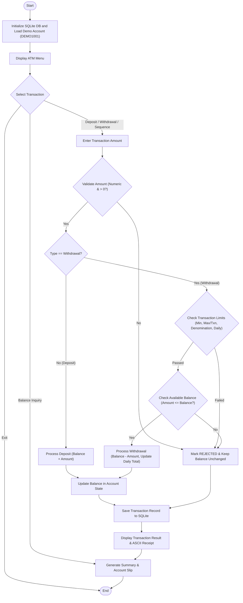

# System Flowchart

The flowchart below illustrates the complete execution path of the **Smart ATM Transaction and Banking Simulation System (Case Study #13)**.

```mermaid
flowchart TD
    A(["Start"]) --> B["Initialize SQLite DB and Load Demo Account (DEMO1001)"]
    B --> C["Display ATM Menu"]
    C --> D{"Select Transaction"}
    D -->|"Balance Inquiry"| M["Generate Summary & Account Slip"]
    D -->|"Exit"| Z(["End"])
    D -->|"Deposit / Withdrawal / Sequence"| E["Enter Transaction Amount"]
    E --> F{"Validate Amount (Numeric & > 0?)"}
    F -->|"No"| R["Mark REJECTED & Keep Balance Unchanged"]
    F -->|"Yes"| G{"Type == Withdrawal?"}
    G -->|"No (Deposit)"| P1["Process Deposit (Balance + Amount)"]
    G -->|"Yes (Withdrawal)"| H{"Check Transaction Limits (Min, Max/Txn, Denomination, Daily)"}
    H -->|"Failed"| R
    H -->|"Passed"| I{"Check Available Balance (Amount <= Balance?)"}
    I -->|"No"| R
    I -->|"Yes"| P2["Process Withdrawal (Balance - Amount, Update Daily Total)"]
    P1 --> U["Update Balance in Account State"]
    P2 --> U
    U --> S["Save Transaction Record to SQLite"]
    R --> S
    S --> T["Display Transaction Result & ASCII Receipt"]
    T --> M
    M --> Z
```
