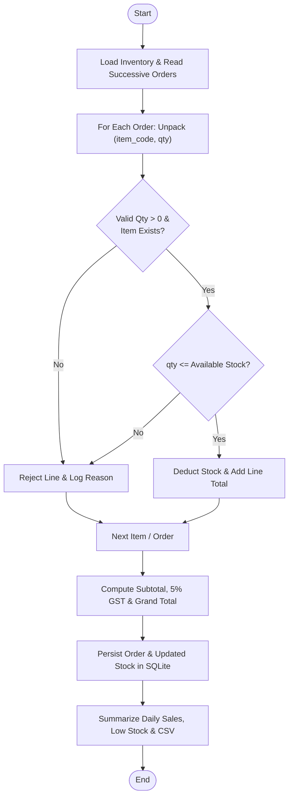

# System Flowchart

```mermaid
flowchart TD
    A(["Start"]) --> B["Load Inventory & Read Successive Orders"]
    B --> C["For Each Order: Unpack (item_code, qty)"]
    C --> D{"Valid Qty > 0 &<br/>Item Exists?"}
    D -- "No" --> D1["Reject Line & Log Reason"]
    D -- "Yes" --> E{"qty <= Available Stock?"}
    E -- "No" --> D1
    E -- "Yes" --> E1["Deduct Stock & Add Line Total"]
    D1 --> F["Next Item / Order"]
    E1 --> F
    F --> G["Compute Subtotal, 5% GST & Grand Total"]
    G --> H["Persist Order & Updated Stock in SQLite"]
    H --> I["Summarize Daily Sales, Low Stock & CSV"]
    I --> J(["End"])
```
