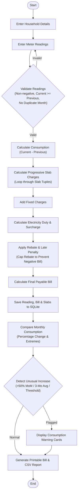

# System Flowchart

```mermaid
flowchart TD
    A(["Start"]) --> B["Enter Household Details"]
    B --> C["Enter Meter Readings"]
    C --> D{"Validate Readings<br/>(Non-negative, Current >= Previous,<br/>No Duplicate Month)"}
    D -- Invalid --> C
    D -- Valid --> E["Calculate Consumption<br/>(Current - Previous)"]
    E --> F["Calculate Progressive Slab Charges<br/>(Loop through Slab Tuples)"]
    F --> G["Add Fixed Charges"]
    G --> H["Calculate Electricity Duty & Surcharge"]
    H --> I["Apply Rebate & Late Penalty<br/>(Cap Rebate to Prevent Negative Bill)"]
    I --> J["Calculate Final Payable Bill"]
    J --> K["Save Reading, Bill & Slabs to SQLite"]
    K --> L["Compare Monthly Consumption<br/>(Percentage Change & Extremes)"]
    L --> M{"Detect Unusual Increase<br/>(>50% MoM / 3-Mo Avg / Threshold)"}
    M -- Flagged --> N["Display Consumption Warning Cards"]
    M -- Normal --> O["Generate Printable Bill & CSV Report"]
    N --> O
    O --> P(["End"])
```
