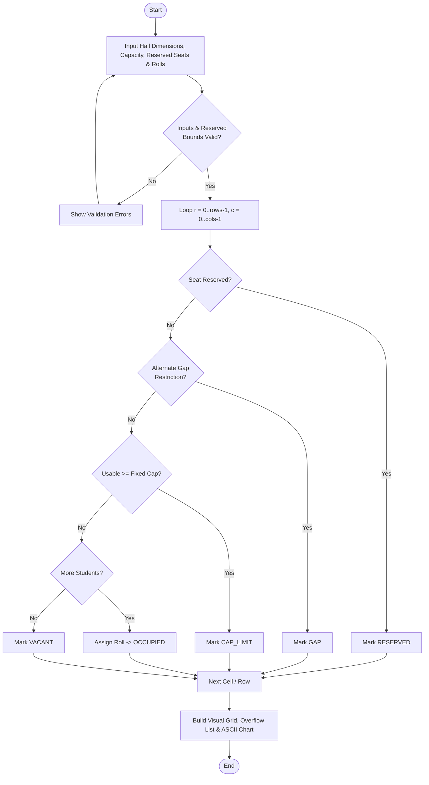

# System Flowchart

```mermaid
flowchart TD
    A(["Start"]) --> B["Input Hall Dimensions, Capacity, Reserved Seats & Rolls"]
    B --> C{"Inputs & Reserved<br/>Bounds Valid?"}
    C -- "No" --> C1["Show Validation Errors"] --> B
    C -- "Yes" --> D["Loop r = 0..rows-1, c = 0..cols-1"]
    D --> E{"Seat Reserved?"}
    E -- "Yes" --> E1["Mark RESERVED"]
    E -- "No" --> F{"Alternate Gap<br/>Restriction?"}
    F -- "Yes" --> F1["Mark GAP"]
    F -- "No" --> G{"Usable >= Fixed Cap?"}
    G -- "Yes" --> G1["Mark CAP_LIMIT"]
    G -- "No" --> H{"More Students?"}
    H -- "Yes" --> H1["Assign Roll -> OCCUPIED"]
    H -- "No" --> H2["Mark VACANT"]
    E1 --> I["Next Cell / Row"]
    F1 --> I
    G1 --> I
    H1 --> I
    H2 --> I
    I --> J["Build Visual Grid, Overflow List & ASCII Chart"]
    J --> K(["End"])
```
