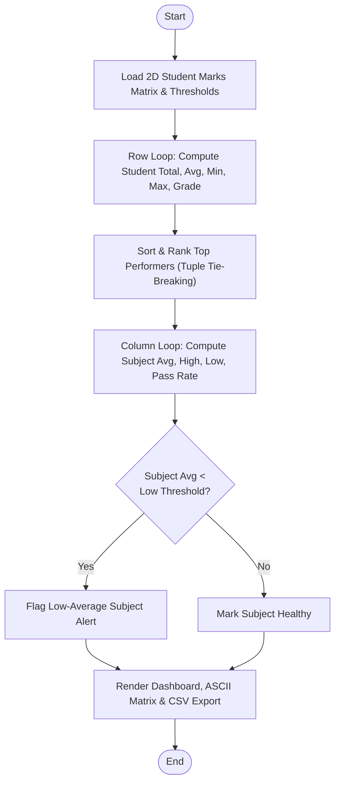

# System Flowchart

```mermaid
flowchart TD
    A(["Start"]) --> B["Load 2D Student Marks Matrix & Thresholds"]
    B --> C["Row Loop: Compute Student Total, Avg, Min, Max, Grade"]
    C --> D["Sort & Rank Top Performers (Tuple Tie-Breaking)"]
    D --> E["Column Loop: Compute Subject Avg, High, Low, Pass Rate"]
    E --> F{"Subject Avg <<br/>Low Threshold?"}
    F -- "Yes" --> F1["Flag Low-Average Subject Alert"]
    F -- "No" --> F2["Mark Subject Healthy"]
    F1 --> G["Render Dashboard, ASCII Matrix & CSV Export"]
    F2 --> G
    G --> H(["End"])
```
