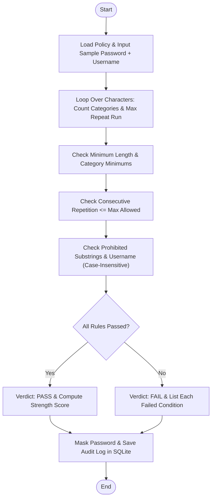

# System Flowchart

```mermaid
flowchart TD
    A(["Start"]) --> B["Load Policy & Input Sample Password + Username"]
    B --> C["Loop Over Characters: Count Categories & Max Repeat Run"]
    C --> D["Check Minimum Length & Category Minimums"]
    D --> E["Check Consecutive Repetition <= Max Allowed"]
    E --> F["Check Prohibited Substrings & Username (Case-Insensitive)"]
    F --> G{"All Rules Passed?"}
    G -- "Yes" --> G1["Verdict: PASS & Compute Strength Score"]
    G -- "No" --> G2["Verdict: FAIL & List Each Failed Condition"]
    G1 --> H["Mask Password & Save Audit Log in SQLite"]
    G2 --> H
    H --> I(["End"])
```
