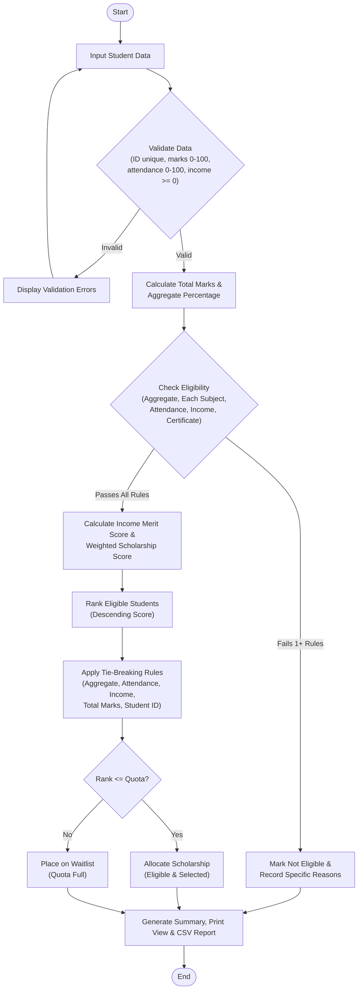

# System Flowchart

```mermaid
flowchart TD
    A(["Start"]) --> B["Input Student Data"]
    B --> C{"Validate Data<br/>(ID unique, marks 0-100,<br/>attendance 0-100, income >= 0)"}
    C -- "Invalid" --> C1["Display Validation Errors"] --> B
    C -- "Valid" --> D["Calculate Total Marks &<br/>Aggregate Percentage"]
    D --> E{"Check Eligibility<br/>(Aggregate, Each Subject,<br/>Attendance, Income, Certificate)"}
    E -- "Fails 1+ Rules" --> E1["Mark Not Eligible &<br/>Record Specific Reasons"]
    E -- "Passes All Rules" --> F["Calculate Income Merit Score &<br/>Weighted Scholarship Score"]
    F --> G["Rank Eligible Students<br/>(Descending Score)"]
    G --> H["Apply Tie-Breaking Rules<br/>(Aggregate, Attendance, Income,<br/>Total Marks, Student ID)"]
    H --> I{"Rank <= Quota?"}
    I -- "Yes" --> I1["Allocate Scholarship<br/>(Eligible & Selected)"]
    I -- "No" --> I2["Place on Waitlist<br/>(Quota Full)"]
    E1 --> J["Generate Summary, Print View & CSV Report"]
    I1 --> J
    I2 --> J
    J --> K(["End"])
```
