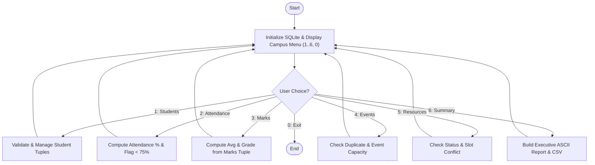

# System Flowchart

```mermaid
flowchart TD
    A(["Start"]) --> B["Initialize SQLite & Display Campus Menu (1..6, 0)"]
    B --> C{"User Choice?"}
    C -- "1: Students" --> C1["Validate & Manage Student Tuples"] --> B
    C -- "2: Attendance" --> C2["Compute Attendance % & Flag < 75%"] --> B
    C -- "3: Marks" --> C3["Compute Avg & Grade from Marks Tuple"] --> B
    C -- "4: Events" --> C4["Check Duplicate & Event Capacity"] --> B
    C -- "5: Resources" --> C5["Check Status & Slot Conflict"] --> B
    C -- "6: Summary" --> C6["Build Executive ASCII Report & CSV"] --> B
    C -- "0: Exit" --> D(["End"])
```
