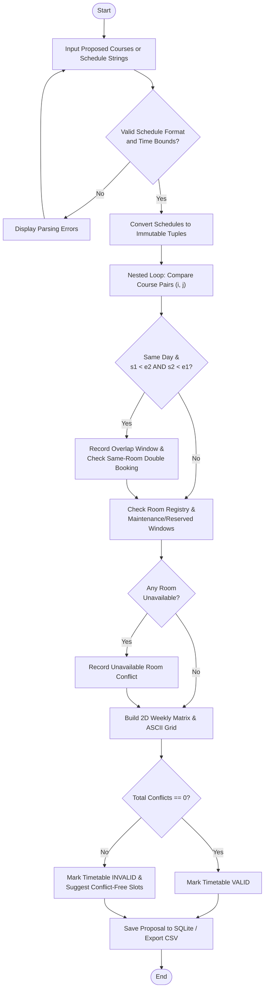

# System Flowchart

```mermaid
flowchart TD
    A(["Start"]) --> B["Input Proposed Courses or Schedule Strings"]
    B --> C{"Valid Schedule Format<br/>and Time Bounds?"}
    C -- "No" --> C1["Display Parsing Errors"] --> B
    C -- "Yes" --> D["Convert Schedules to Immutable Tuples"]
    D --> E["Nested Loop: Compare Course Pairs (i, j)"]
    E --> F{"Same Day &<br/>s1 < e2 AND s2 < e1?"}
    F -- "Yes" --> F1["Record Overlap Window &<br/>Check Same-Room Double Booking"]
    F -- "No" --> G["Check Room Registry &<br/>Maintenance/Reserved Windows"]
    F1 --> G
    G --> H{"Any Room<br/>Unavailable?"}
    H -- "Yes" --> H1["Record Unavailable Room Conflict"]
    H -- "No" --> I["Build 2D Weekly Matrix & ASCII Grid"]
    H1 --> I
    I --> J{"Total Conflicts == 0?"}
    J -- "Yes" --> J1["Mark Timetable VALID"]
    J -- "No" --> J2["Mark Timetable INVALID &<br/>Suggest Conflict-Free Slots"]
    J1 --> K["Save Proposal to SQLite / Export CSV"]
    J2 --> K
    K --> L(["End"])
```
